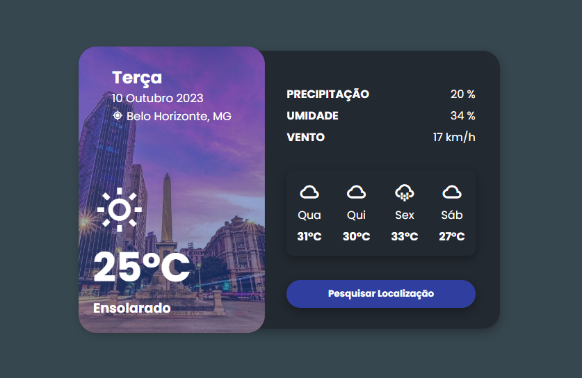

# Clima Tempo App Ui Design
Uma lading page que mostra o clima tempo. Esta versão não se atualiza recorrentemente, é apenas o modelo de como ficaria.
Estaremos usando transições CSS, CSS Flexbox, float para nosso design e transições e animações CSS para alguns efeitos de animação interessantes.

# Screenshot
Print do Projeto aberto:

